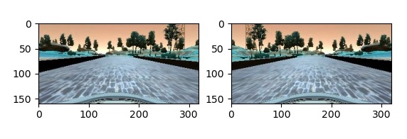

# **Behavioral Cloning** 

## Writeup Template

### You can use this file as a template for your writeup if you want to submit it as a markdown file, but feel free to use some other method and submit a pdf if you prefer.

---

**Behavioral Cloning Project**

The goals / steps of this project are the following:
* Use the simulator to collect data of good driving behavior
* Build, a convolution neural network in Keras that predicts steering angles from images
* Train and validate the model with a training and validation set
* Test that the model successfully drives around track one without leaving the road
* Summarize the results with a written report


## Rubric Points
### Here I will consider the [rubric points](https://review.udacity.com/#!/rubrics/432/view) individually and describe how I addressed each point in my implementation.  

---
### Files Submitted & Code Quality

#### 1. Submission includes all required files and can be used to run the simulator in autonomous mode

My project includes the following files:
* model.py containing the script to create and train the model
```python
python model.py 
#-> produces model.h5 - training with Udadicty Data
```
* drive.py for driving the car in autonomous mode
* model.h5 containing a trained convolution neural network 
* writeup_report.md summarizing the results

#### 2. Submission includes functional code
Using the Udacity provided simulator and my drive.py file, the car can be driven autonomously around the track by executing 
```sh
python drive.py model.h5
```

#### 3. Submission code is usable and readable

The model.py file contains the code for training and saving the convolution neural network. The file shows the pipeline I used for training and validating the model, and it contains comments to explain how the code works.

### Model Architecture and Training Strategy

#### 1. An appropriate model architecture has been employed

My model consists of a convolution neural network using the architecture shown during the lesson (model.py lines 94 - 107) 

The model includes RELU layers to introduce nonlinearity (code line 97 - 101), and the data is normalized in the model using a Keras lambda layer (code line 95). 

#### 2. Attempts to reduce overfitting in the model

The model contains dropout layers in order to reduce overfitting (model.py lines 104). 

The model was trained and validated on different the data set, provided by udacity. I used the `train_test_split`function in order to obtain different data sets for training and validation. In order to prevent overfitting I shuffeld the data and used a generator (line 21). The model was tested by running it through the simulator and ensuring that the vehicle could stay on the track. Based on the final run, I produced the video `video.mp4`

#### 3. Model parameter tuning

The model used an adam optimizer, so the learning rate was not tuned manually (model.py line 113).

#### 4. Appropriate training data

Training data was chosen to keep the vehicle driving on the road. I used a combination of center lane driving, recovering from the left and right sides of the road ... 

For details about how I created the training data, see the next section. 

### Model Architecture and Training Strategy

#### 1. Solution Design Approach

The overall strategy for deriving a model architecture was at first to follow the instructions in the chapter "Project Behavioral Cloning".

My first step was to use a dense layer as described in the lesson in order to get the pipeline running.

The first real running model was the LeNet model (line 76 - 88) with the fit-operation: `model.fit(X_train, y_train, validation_split=0.2, shuffle=True)`.

It was running, but the output showed overfitting, since the validation losses were bigger, than the training losses.


Using the generator with a better shuffle-strategy (line 21 - 65)
helped to perform better.

And the LeNet Model was able to drive a good part of the simulator. It only failed on the curve after the bridge.

At first I tried to obtain more Data and therefore prepared the files:
- `model_ownData_cw.py`
- `model_ownData_cc2.py`

```python
# training with enhanced data-sets - not used for final submission
python model_fine_tune.py 
#-> produces model_ownData_cw.h5 - training with clock-wise recorded data myData
python model_fine_tune_ccw.py 
#-> produces model_ownData_ccw.h5 - training with counter clockwise recorded data myData2
```

The final step was to run the simulator to see how well the car was driving around track one. Unfortunately using addtional data with the LeNet structure remained falling out of the curve after the bridge.

So at the end I chose the NVidia model structure.

#### 2. Final Model Architecture

The final model architecture (model.py lines 94 - 107) consisted of a convolution neural network with the following layers and layer sizes ...

```python
    model = Sequential()
    model.add(Lambda(lambda x: (x / 255.0) - 0.5, input_shape=(160,320,3)))
    model.add(Cropping2D(cropping=((70,25), (0,0))))
    model.add(Conv2D(24, (5,5), subsample=(2,2),activation="relu"))
    model.add(Conv2D(36, (5,5), subsample=(2,2),activation="relu"))
    model.add(Conv2D(48, (5,5), subsample=(2,2),activation="relu"))
    model.add(Conv2D(64, (3,3),activation="relu"))
    model.add(Conv2D(64, (3,3),activation="relu"))
    model.add(Flatten())
    model.add(Dense(100))
    model.add(Dropout(0.5))
    model.add(Dense(50))
    model.add(Dense(10))
    model.add(Dense(1))
```

Here is a visualization of the architecture (note: visualizing the architecture is optional according to the project rubric)


#### 3. Creation of the Training Set & Training Process

To capture good driving behavior, I first recorded also my own data, also I did not use it finaly. Here is an example image of center lane driving:


To augment the data sat, I also flipped images and angles (lines 52 - 56). For example, here is an image that has then been flipped, but using the file snippets.py:




I finally randomly shuffled the data set and put 20% of the data into a validation set (line 18). 

I used this training data for training the model. The validation set helped determine if the model was over or under fitting. The number of epochs, I finaly chose was 5 without going deeper in investigation here.
